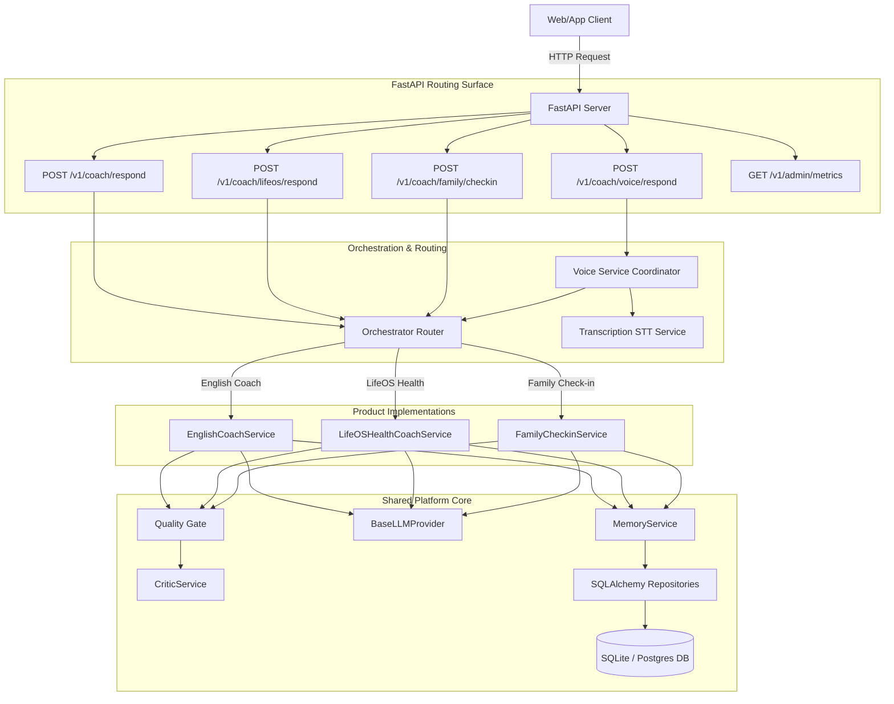

# Technical Architecture - Warborn Multi-Agent Platform

This document details the modular architectural layout of the **Warborn Multi-Agent Platform Core**, supporting multiple concurrent coach products (English Coach, LifeOS Habit Helper, and Family Parent Check-in) over a shared database persistence and memory retrieval layer.

---

## 1. High-Level Core Design System

---

## 2. Shared Core Services vs. Product Separations

To ensure high reliability and codebase maintainability, a strict decoupling boundary is maintained between **Generic Core Services** and **Product Specific Configs**:

### Generic Platform Core (Shared across all products):
- **Database Connection Layer** (`app/db/`): Manages async connections, declarative tables mapping, and session transactions.
- **Provider Interface** (`app/providers/`): Abstracts communication with OpenAI models, featuring retries, structured JSON checks, and mock provider fallbacks.
- **Observability System** (`app/observability/`): Collects cost telemetry, records metrics splits, and logs request spans.
- **Memory Service** (`app/services/memory_service.py`): Performs lookup and formatting of approved examples from the DB.
- **Token Budget Guardrail** (`app/services/context_budget.py`): Measures token sizes and clips context payloads dynamically to keep prompt prefixes stable.

### Product Implementations (Partitioned under `app/products/`):
- **Schemas**: Custom Pydantic models for incoming payload validation and outbound formatting rules.
- **Services**: Custom orchestration logic and pipelines.
- **Prompt Configs**: System templates and output structure rules.
- **Policies**: Safe boundary assertions (e.g. wellness medical disclaimers, distress escalation checking).

---

## 3. Orchestration Flow & Quality Control
1. **Dynamic Intent Routing**: The `OrchestrationRouter` parses text inputs for keywords (such as `calories`, `sleep` to select LifeOS; or `mom`, `checkin` to select Family check-in).
2. **Quality Gate Pass**: Outputs generated by the active LLM are piped into `QualityGate`.
3. **Critic Analysis**: The `CriticService` scans the output for system prompt instruction leaks or incomplete fields.
4. **Repair Attempt Loop**: If leaks are detected, the system triggers *exactly one* formatting repair pass requesting valid schemas. If repair fails again, a safe fallback payload is output to maintain low-latency guardrails.
