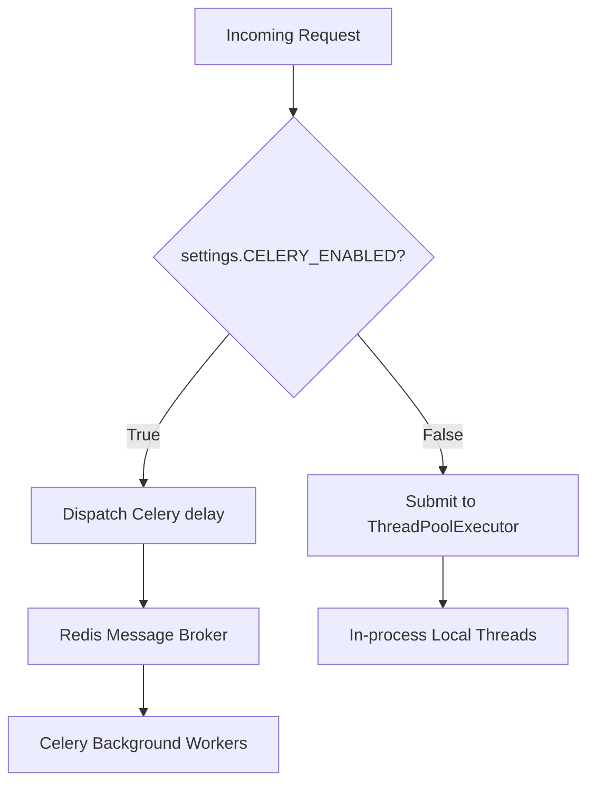

# Queue Architecture (Celery & Redis)

This document describes the design of the durable task scheduling engine.

---

## 1. Celery task states and Local Fallback

To prevent local development dependencies on Redis, the queue is config-driven:



- **Staging / Production**: `CELERY_ENABLED=True` routes tasks to a Redis broker.
- **Local Dev / Unit Tests**: `CELERY_ENABLED=False` falls back to an in-memory ThreadPoolExecutor, allowing the system to run out-of-the-box.

---

## 2. Task Run Database Tracking

Every background task writes execution tracking data to the `task_runs` table:

```
+--------------------------------------------------------------+
|                          TASK_RUNS                           |
+---------------------------------+----------------------------+
| Column Name                     | Type                       |
+---------------------------------+----------------------------+
| id (UUID)                       | VARCHAR(100) (PK)          |
| task_name                       | VARCHAR(100)               |
| status                          | VARCHAR(30)                |
| retries                         | INT                        |
| duration_ms                     | FLOAT                      |
| failure_reason                  | TEXT (Nullable)            |
| created_at                      | DATETIME                   |
| completed_at                    | DATETIME (Nullable)        |
+---------------------------------+----------------------------+
```

Status updates dynamically cycle from `STARTED` to `SUCCESS` or `FAILURE`.
